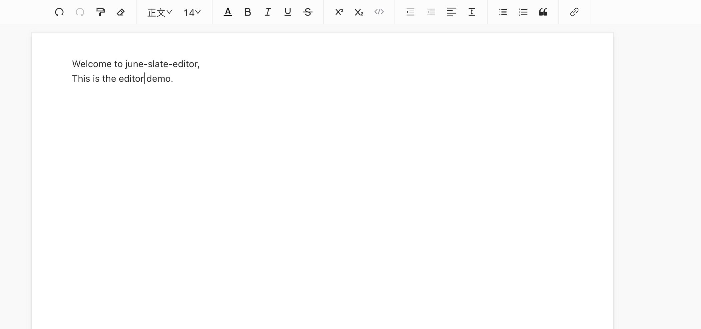

# june-slate-editor
基于React、Slate.js和Antd的开箱即用富文本编辑器


```
| 名称 | 功能 |
| - | - |
| undo | 撤销 |
| redo | 重做 |
| heading | 标题 |
| fontSize | 字体 |
| color | 背景颜色和文字颜色 |
| bold | 粗体 |
| italic | 斜体 |
| underline | 下划线 |
| strikethrough | 删除线 |
| superscript | 上标 |
| subscript | 下标 |
| inlineCode | 行内代码 |
| indent | 缩进 |
| align | 对齐 |
| lineHeight | 行高 |
| unorderedlist | 无序列表 |
| orderedlist | 有序列表 |
